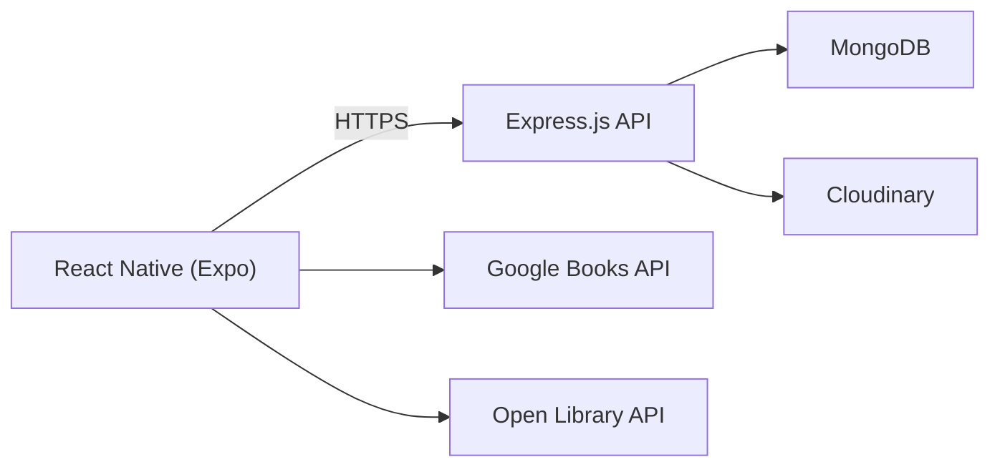

<p align="center">
  
</p>

<h3 align="center">
  A full-stack mobile application for managing personal book collections, discovering books, and borrowing or lending books with friends.
</h3>

---

<h2 align="center">Features</h2>

<table>
  <colgroup>
    <col style="width:40%">
    <col style="width:60%">
  </colgroup>
  <thead>
    <tr>
      <th align="left">Module</th>
      <th align="left">Description</th>
    </tr>
  </thead>
  <tbody>
    <tr>
      <td><strong>Authentication</strong></td>
      <td>Secure user authentication, persistent login sessions, and profile management.</td>
    </tr>
    <tr>
      <td><strong>Personal Library</strong></td>
      <td>Build and organize your personal book collection with custom notes, book condition, availability, and reading status.</td>
    </tr>
    <tr>
      <td><strong>ISBN Scanner</strong></td>
      <td>Scan book barcodes using the device camera to automatically retrieve book information.</td>
    </tr>
    <tr>
      <td><strong>Manual Book Entry</strong></td>
      <td>Add books manually using an ISBN when barcode scanning is unavailable.</td>
    </tr>
    <tr>
      <td><strong>Book Discovery</strong></td>
      <td>Search books by title, author, or ISBN and import metadata from Google Books and Open Library.</td>
    </tr>
    <tr>
      <td><strong>User Search</strong></td>
      <td>Search for users, visit their profiles, and browse their public libraries.</td>
    </tr>
    <tr>
      <td><strong>Borrow Requests</strong></td>
      <td>Send, receive, accept, decline, and cancel borrow requests.</td>
    </tr>
    <tr>
      <td><strong>Lending & Borrowing</strong></td>
      <td>Track borrowed and lent books with ownership details, due dates, and borrowing history.</td>
    </tr>
    <tr>
      <td><strong>Return Requests</strong></td>
      <td>Request returns, approve or decline return requests, and complete the return workflow.</td>
    </tr>
    <tr>
      <td><strong>Return Reminders</strong></td>
      <td>Send reminders to borrowers when books need to be returned.</td>
    </tr>
    <tr>
      <td><strong>Friends System</strong></td>
      <td>Send, receive, accept, decline, and manage friend requests.</td>
    </tr>
    <tr>
      <td><strong>Notifications</strong></td>
      <td>Receive notifications for borrow requests, return requests, reminders, and friend activities.</td>
    </tr>
    <tr>
      <td><strong>Book Details</strong></td>
      <td>View complete book metadata, availability, ownership, borrowing status, and personal notes.</td>
    </tr>
    <tr>
      <td><strong>Mobile UI</strong></td>
      <td>Modern React Native interface featuring reusable components, intuitive navigation, loading skeletons, pull-to-refresh, consistent theming, custom feedback modals, empty and error states, and smooth animations for an improved user experience.</td>
    </tr>
  </tbody>
</table>

---

<h2 align="center">Feature Demonstrations</h2>

| Authentication | Library & Profile | Book Search |
| :------------: | :---------------: | :---------: |
|  |  |  |
| Login, registration, and authentication flow. | Personal library, home feed, and profile. | Search books and users. |

| Add Book (Scan) | Add Book (ISBN) | Borrow Request |
| :-------------: | :-------------: | :------------: |
|  |  |  |
| Scan a barcode to import a book. | Add a book using its ISBN. | Send, review, and accept borrow requests. |

| Return Workflow | Book Details | Friends |
| :-------------: | :----------: | :-----: |
|  |  |  |
| Return requests and reminders. | View book metadata and borrowing status. | Send friend requests and manage connections. |

| Notifications |  |  |
| :-----------: | :-: | :-: |
|  | | |
| Notification center and activity updates. | | |
---

<h2 align="center">Architecture</h2>



---

<h2 align="center">Tech Stack</h2>

### Mobile


### Backend


### Database & Storage


### APIs & Tools


<!--  -->

---

<h2 align="center">Project Structure</h2>

### Client

```text
client/
├── app/                
│   ├── (app)/           
│   │   ├── (tabs)/       # Home, Search, Requests, Notifications, Profile
│   │   ├── add/
│   │   ├── books/
│   │   ├── profile/
│   │   └── request/
│   ├── (auth)/           # Authentication screens
│   └── _layout.tsx
│
├── assets/               # Fonts & images
│
├── src/
│   ├── components/
│   │   ├── common/
│   │   ├── feature/
│   │   ├── skeleton/
│   │   └── ui/
│   ├── constants/
│   ├── hooks/
│   ├── lib/
│   ├── providers/
│   ├── schema/
│   ├── services/
│   ├── store/
│   └── types/
│
├── app.json
├── package.json
└── tsconfig.json
```
### Server

```text
server/
├── src/
│   ├── config/
│   ├── constants/
│   ├── controllers/
│   ├── middleware/
│   ├── models/
│   ├── routes/
│   ├── services/
│   ├── validation/
│   ├── mapper/
│   ├── lib/
│   ├── types/
│   ├── app.ts
│   └── server.ts
│
├── package.json
└── tsconfig.json
```

---

<h2 align="center">Getting Started</h2>

### 1. Clone the Repository

```bash
git clone https://github.com/yourusername/bookquest.git
```

### 2. Install the Client

```bash
cd client
npm install
```

### 3. Install the Server

```bash
cd ../server
npm install
```

### 4. Start the Backend

```bash
npm run dev
```

### 5. Start the Mobile App

```bash
cd ../client
npx expo start
```

---

<h2 align="center">Future Improvements</h2>

- AI-powered book recommendations based on reading history and borrowing activity.
- Admin dashboard for managing users, books, reports, and platform moderation.
- Dark mode and additional theme customization.
- Push notifications for borrow requests, reminders, and friend activity.
- Improved borrowing and return workflows with enhanced user experience.
- Advanced search, filtering, and sorting options.
- User customization options, including profile personalization and library preferences.
- Enhanced security with features such as rate limiting, account protection, and session management.
- Performance optimizations and continued codebase refactoring for improved maintainability.
- Expanded analytics and reading insights for personal library activity.
